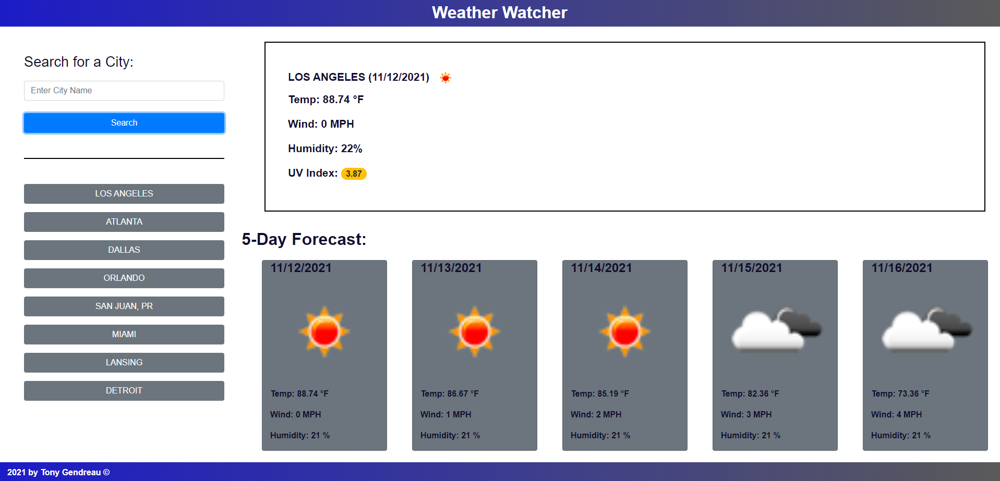

# Weather_Dashboard

## Purpose
A weather website that lets the user either search for any cities weather, or to have some preset cities. 

## Built with
* HTML
* CSS
* Javascript
* Bootstrap
* Moment.js
* JQuery
* Simulate a button press when hitting enter key

## Demonstrates the following skills:

    * Working with an array of Objects.
    * Creating a dynamic list of buttons.
    * Buttons re-organize based on which button clicked.
    * Working with complicated logic
    * Dynamically creating web elements.
    * Responsive design.

## Deployed Website
https://tgtiburon.github.io/weather_dashboard/

## Github Repository
https://github.com/tgtiburon/Weather_Dashboard

##

Made by Tony Gendreau

