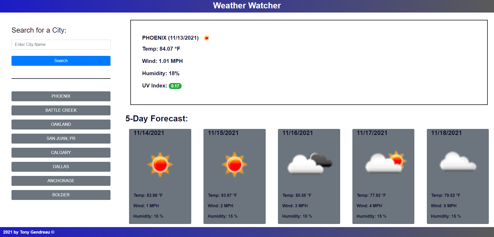

# Weather_Watcher

## Purpose
A weather website that lets the user search for any city in the world's weather.  It also stores the last 8 searches to make rescanning your favorite cities easier. 

## Built with
* HTML
* CSS
* Javascript
* Bootstrap
* Moment.js
* JQuery

## Demonstrates the following skills:

    * Working with an array of Objects.
    * Creating a dynamic list of buttons.
    * Buttons re-organize based on which button clicked.
    * Working with complicated logic
    * Dynamically creating web elements.
    * Responsive design.
    * Simulate a button press when hitting enter key.

## Deployed Website
https://tgtiburon.github.io/Weather_Watcher/

## Github Repository
https://github.com/tgtiburon/Weather_Watcher

##

Made by Tony Gendreau

