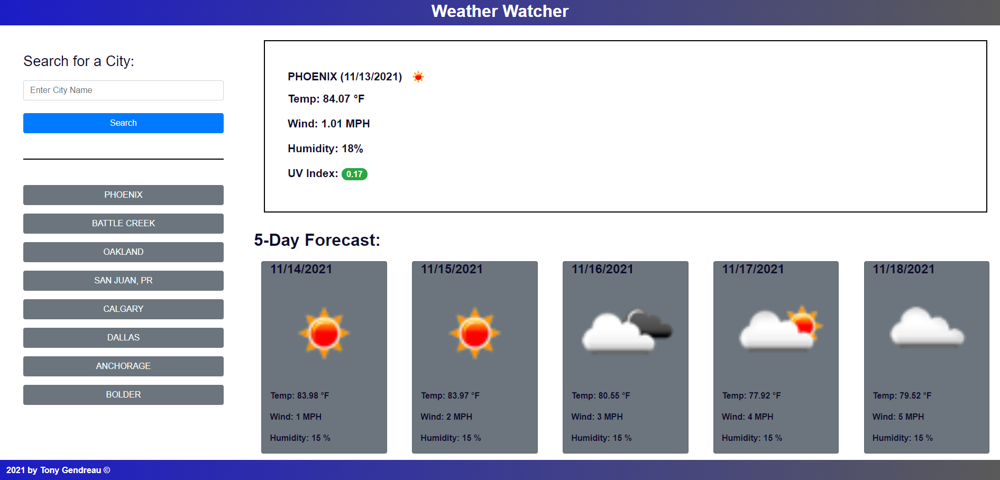

# Weather_Watcher
---

  
  
   
   
   
   
   
## Description

A weather website that lets the user search for any city in the world's weather.  It also stores the last 8 searches to make rescanning your favorite cities easier. 

---
  ## Table of Contents

  [Features](#features)

  [Screenshot](#screenshot)
    
  [Usage](#usage)
    
  [License](#license)

  [Questions](#questions)
  
  

---

## Features

      1. Working with an array of objects. 

      2. Creating a dynamic list of buttons. 

      3. Working with complicated logic. 

      4. Dynamically creating web elements. 

      5.  Responsive design. 

      6. Simulate a button press when hitting enter key. 
---

## Screenshot 
  
  
  

---
  ## Usage

      1. Go Here: https://tgtiburon.github.io/Weather_Watcher/ 

  ---
  ## License 

  &emsp; 

      To read about the license of this project click the link below.

  &emsp;[License](https://github.com/tgtiburon/Weather_Watcher/blob/main/LICENSE) 

---
## Questions

If you have any questions about this project feel free to email me at <tg.tiburon@gmail.com>.  

To see the rest of my portfolio, visit [Github](https://github.com/tgtiburon).

Below is a graphic displaying my most used languages on github.

This Readme file was created with Readme Architect by Tony Gendreau &copy;
